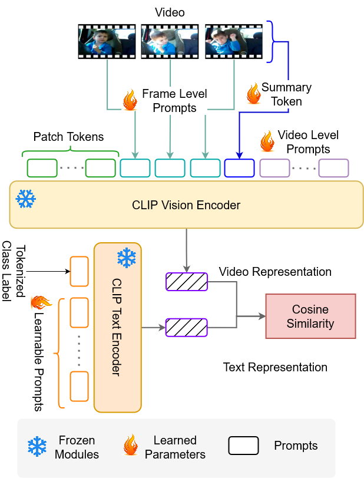

# Vita-CLIP
## Abstract
核心问题：能否为视频识别开发一个在supervised和zero-shot方面都表现良好的模型

在研究CLIP时，通过微调来提高监督学习下的性能和通过冻结特定层来提升zeroshot能力的过程会互相扯后腿，所以近期的大部分工作也倾向于分别训练两个模型来做supervised和zero-shot。但本文的目标是提出一个多模态提示学习方案，让Vita-CLIP模型仅仅通过一次联合训练就在supervised和zero-shot的情况下都能取得不错的效果。

## Introduction
用训练图文对模型的思路去进行视频识别工作不太靠谱，可能有对齐问题且计算成本剧增->所以有两种思路解决：一是在视觉侧或者文本侧进行提示微调，增添额外的transformer层来改进时序学习；二是端到端微调（这个可能得参考CLIP4Clip）->这两种思路的问题在于它们会降低模型的zero-shot泛化能力。

冻结backbone、学习额外的轻量级模块，来保持原始backbone的泛化能力并适应视频侧：通过全局视频级prompt，学习视频数据的整体分布特征（e.g.motion和dynamics，不是很明白意思，直译是运动和动力学？）;局部帧级prompt通过对所有帧的分类token进行直接的反馈（directly conditioning），提示每帧的判别信息是哪个模型;用一个总结性的prompt，将整个视频序列响应提取到一个总结向量中；在text encoder中使用可学习的上下文来提升文本上下文的建模效果并增强视频分类标签描述。

Vita-CLIP学习视频和文本特定的上下文向量，在视觉侧明确建模时间信息和视频数据分布，将片段中每一帧的判别信息与其他每一帧的判别信息聚合在一起，同时还提供了逐层学习能力，以更好地捕获数据分布；在文本层学习互补语义上下文，以更好地适应语言表示。

大体框架如下：

在zero-shot任务中，Vita-CLIP分别在HMDB-51、UCF101和Kinetics-600数据集上获得了比最近的SoTA X-CLIP高出4.0%、3.0%和2.2%的accuracy。

## Framework
Vita-CLIP的提示架构如下：

对于文本encoder：用了一个12层BERT，embedding size是512，Context length是77，每层由一个多头自注意力（MHSA）和FFN组成。

对于视频encoder：视频空间大小为H* W，有T个采样，每帧被划分为N个P* P大小的不重叠正方形patch，将每个帧的patch平面化为一组向量$x_{t,i}$，t为帧号，i为patch号，还有一个线性投影层$P_{emb}$与一个分类标记$x_{cls}$。则输入视频encoder的token序列为

$z_t^{(0)}=[x_{cls},P_{emb}^Tx_{t,1},...,P_{emb}^Tx_{t,N}]+e$，e为时间与空间的编码之和

在$L_v$分层视频编码器中，第l层的帧级表示为

$z_t^{(l)}=f_{\theta_v}^{(l)}(z_t^{(l-1)})$，其中$f_{\theta_v}^{(l)}$为视频编码器的第l层。

为了获得每帧的表示并提取分类标记$x_{cls}$，使用线性投影层$P_{out}^T$：

$v_t=P_{out}^{T}z_{t,0}^{L_v}$

对每帧表示$v_i$用一个AvgPool平均处理来获得一个聚合的视频表示v:

$v=AvgPool([v_1,...,v_T])$

下面介绍一下上文反复吹牛逼的Video Encoder的辅助手段：Summary Token，Global Prompt Tokens和Local Prompt Tokens

Summary Token汇总了每一层所有帧的判别信息：

$Z_{0,proj}^{l-1}=P_{sum}^TZ_0^{(l-1)}$
$S^{(l)}=MHSA（LN（Z_{0,proj}^{l-1}））+Z_{0,proj}^{l-1}$,LN代表层归一化

Global Prompt Tokens：$G^{(l)}$是随机初始化的可学习向量，用来为模型提供额外的学习能力来学习数据分布。

Local Prompt Tokens：$L^{(l)}=[l_1^{(l)},...,l_T^{(l)}]$也是随机初始化的可学习向量，取决于各自的分类token{CLS}，用于将每帧判别信息传递给CLIP中的其余帧。

## Code Analysis
等我在colab整完CLIP再说，到时候看看代码上有没有特别值得一提的地方

## Result and Analysis
Vita-CLIP以经典CLIP为baseline做了个消融实验，其中CLIP在K400数据集中（30 epochs，zero-shot，每个视频8帧）的accuracy为40.1%，添加了Class-Specific Context、全局视频级提示、局部帧级提示与summary token后提升到了80.51%

在文本端提示中，CSC相比UC（Unified Context）提供了更好的准确性，因为这样使得每个类都有一个独立的可学习的上下文，在K400数据集的准确性随文本提示的数量上升而上升，但在数量大于8后上升趋势不显著 -> 因此把文本端提示固定为8个CSC。

## Test Dateset
Kinetics-600:共600个类别，每个类别至少600个视频以上，每段视频持续10秒左右。类别主要分为三大类：人与物互动，比如演奏乐器；人人互动，比如握手、拥抱；运动等。即person、person-person、person-object，共50万左右的视频。下载以及详细介绍可参考：https://zhuanlan.zhihu.com/p/347490726。

HMDB51：包含51类动作，共有6849个视频，每个动作至少包含51个视频，分辨率320*240,。来自于YouTube，google视频等，共２G。下载及详细介绍可参考：https://blog.csdn.net/xiaosongshine/article/details/99700874

UCF101是一个现实动作视频的动作识别数据集，收集自YouTube，提供了来自101个动作类别的13320个视频，大小为6.46G，下载及详细介绍可参考：https://blog.csdn.net/lidc1004/article/details/117195260

K400：K600的初始版本，顺带一提，现在已经有K700了

SSv2：包含108499个视频，横跨174个标签，每个视频2-6秒，下载链接可参考：https://pan.baidu.com/s/1NCqL7JVoFZO6D131zGls-A#list/path=%2F，提取码为07ka